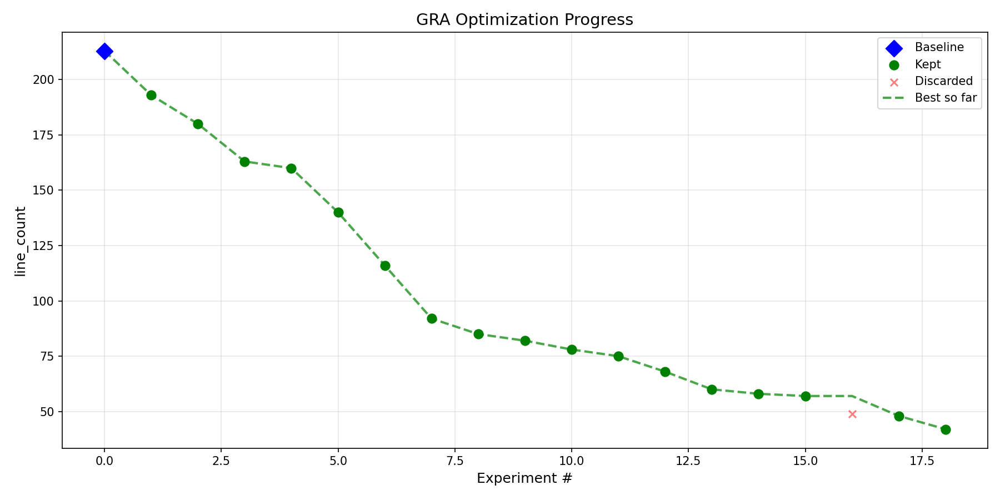

# General AutoResearch (GRA)

Autonomous code optimization using LLMs. Point it at any file or folder, and it iteratively improves any metric — line count, accuracy, speed, test scores — using [Claude Code](https://docs.anthropic.com/en/docs/claude-code) under the hood.

Inspired by [Karpathy's autoresearch](https://github.com/karpathy/autoresearch), generalized to optimize **any metric** on **any codebase**.

## How it works

```
You provide:        GRA auto-detects:        Then it loops:
  - target file       - run command            1. Claude Code modifies code
  - timeouts          - metric + pattern       2. Evaluate & extract metric
  - strategy          - direction              3. Keep improvements, discard regressions
                                               4. Repeat until time budget exhausted
```

- **Claude Code as the engine** — not raw API calls, but the full Claude Code agent with file reading, editing, and search tools
- **AI auto-configuration** — analyzes your code to determine the run command, metric, regex pattern, and optimization direction
- **Git as experiment backbone** — every modification is a commit; rejected changes are `git reset`
- **Full memory** — a TSV lab notebook logs every attempt so the LLM avoids repeating failures

## Install

```bash
pip install general-research-automation
```

Or from source:

```bash
git clone https://github.com/ryx2/general-autoresearch.git
cd general-autoresearch
pip install -e .
```

### Requirements

- Python 3.10+
- `ANTHROPIC_API_KEY` environment variable
- [Claude Code CLI](https://docs.anthropic.com/en/docs/claude-code): `npm install -g @anthropic-ai/claude-code`

## Quick start

```bash
gra
```

Just 4 questions:

1. **Target** — file or folder the AI will optimize
2. **Per-run timeout** — how long each evaluation can take (e.g. `5m`)
3. **Total timeout** — how long the whole optimization runs (e.g. `2h`)
4. **Strategy notes** — optional free-form guidance (press enter to skip)

Everything else — run command, metric name, regex pattern, direction — is **auto-detected by AI**.

## Example: minimize lines of code

The `examples/minimize_lines/` directory contains a deliberately verbose Python function (213 lines) that processes sales data. The goal: make it as short as possible while keeping all functionality and readability.

```bash
cd examples/minimize_lines
git init && git add -A && git commit -m "init"
gra
# Target: verbose_function.py
# Per-run timeout: 30s
# Total timeout: 10m
# Strategy: Retain all functionality but minimize line count. Don't remove comments. Keep it human readable.
```

GRA auto-detects that `evaluate.py` runs the tests and reports `line_count`, then iteratively condenses the function.

### Results: 213 lines → 42 lines in 10 minutes

19 experiments, 18 kept, 1 discarded, 0 crashes.



<details>
<summary>Before (213 lines)</summary>

```python
def process_sales_data(raw_data):
    # Validate that we received data
    if raw_data is None:
        raise ValueError("raw_data cannot be None")

    # Initialize the total revenue accumulator
    total_revenue = 0

    # Initialize a list to store individual order values
    order_values = []

    # Initialize a dictionary to store revenue by region
    revenue_by_region = {}

    # Initialize a dictionary to store order count by region
    orders_by_region = {}

    # Iterate through each record in the raw data
    for record in raw_data:
        # Extract the product name from the current record
        product_name = record["product"]

        # Extract the quantity from the current record
        quantity = record["quantity"]

        # Calculate the order value by multiplying quantity and price
        order_value = quantity * price

        # Check if the region already exists in the revenue dictionary
        if region in revenue_by_region:
            # If it exists, add the order value to the existing total
            revenue_by_region[region] = revenue_by_region[region] + order_value
        else:
            # If it doesn't exist, initialize with the current order value
            revenue_by_region[region] = order_value

        # ... (continues for 213 lines)
```

</details>

<details>
<summary>After (42 lines) — all tests still pass</summary>

```python
def process_sales_data(raw_data):
    """Process raw sales data and return a summary report."""
    if raw_data is None:
        raise ValueError("raw_data cannot be None")
    if len(raw_data) == 0:
        return {"total_revenue": 0, "total_orders": 0, "average_order_value": 0,
                "regions": {}, "top_products": [], "statistics": {}}

    # Initialize accumulators and tracking dictionaries
    total_revenue, order_values = 0, []
    revenue_by_region, orders_by_region = {}, {}
    revenue_by_product, quantity_by_product = {}, {}

    # Process each record
    for record in raw_data:
        order_value = record["quantity"] * record["price"]
        total_revenue += order_value
        order_values.append(order_value)
        revenue_by_region[record["region"]] = revenue_by_region.get(record["region"], 0) + order_value
        orders_by_region[record["region"]] = orders_by_region.get(record["region"], 0) + 1
        revenue_by_product[record["product"]] = revenue_by_product.get(record["product"], 0) + order_value
        quantity_by_product[record["product"]] = quantity_by_product.get(record["product"], 0) + record["quantity"]

    total_orders = len(raw_data)
    average_order_value = total_revenue / total_orders

    # Build regional breakdown and top products inline in return
    return {
        "total_revenue": round(total_revenue, 2),
        "total_orders": total_orders,
        "average_order_value": round(average_order_value, 2),
        "regions": {r: {"revenue": revenue_by_region[r], "orders": orders_by_region[r],
                        "average_order_value": round(revenue_by_region[r] / orders_by_region[r], 2),
                        "percentage_of_total": round((revenue_by_region[r] / total_revenue) * 100, 2)}
                   for r in revenue_by_region},
        "top_products": [{"product": n, "revenue": revenue_by_product[n], "quantity": quantity_by_product[n]}
                        for n in sorted(revenue_by_product, key=revenue_by_product.get, reverse=True)[:5]],
        "statistics": dict(zip(["min", "max", "median", "std_dev"],
                              [round(f(order_values), 2) if (f != statistics.stdev or len(order_values) > 1) else 0
                               for f in [min, max, statistics.median, statistics.stdev]]))
    }
```

</details>

## Resume from config

Every run saves a `gra_config.json`. Reuse it:

```bash
gra --config path/to/gra_config.json
```

## Generate graph

```bash
gra --graph results.tsv
```

Generates `progress.png` showing metric improvement over experiments.

## Output

Each run produces:

- **Git branch** `gra/<timestamp>` — clean chain of validated improvements
- **results.tsv** — full lab notebook of every experiment
- **progress.png** — optimization progress graph
- **gra_config.json** — reproducible session config

## Advanced: full config

For full control, create `gra_config.json` manually:

```json
{
  "target": "train.py",
  "run_timeout": 300,
  "total_timeout": 28800,
  "run_command": "python train.py",
  "metric_name": "val_loss",
  "metric_pattern": "val_loss:\\s+([\\d.eE+-]+)",
  "direction": "minimize",
  "strategy": "Focus on optimizer and architecture changes",
  "readonly_files": ["data.py"],
  "model": "claude-sonnet-4-20250514",
  "max_fix_attempts": 3
}
```

Then: `gra --config gra_config.json`

## License

MIT
